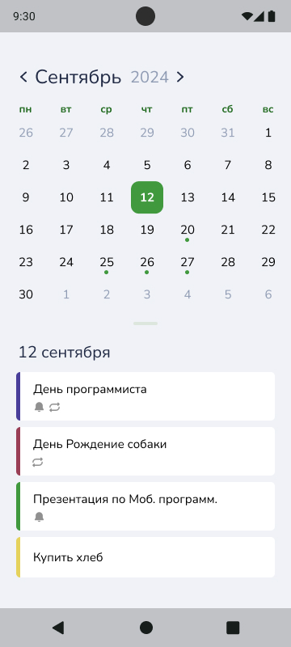
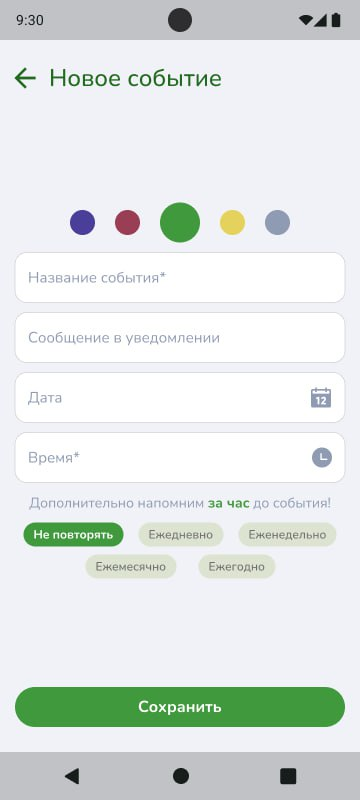
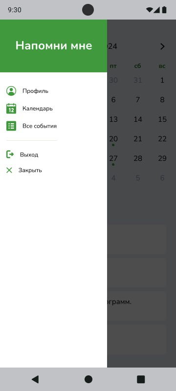
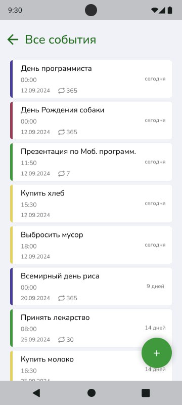

# RemindMeApp
emindMeApp — мобильное Android-приложение для управления напоминаниями о событиях с поддержкой регулярных повторений, офлайн-режима и сетевой синхронизации.

---

## Возможности

- Поддержка регулярных событий (ежедневные, еженедельные, ежемесячные и пользовательские шаблоны)
- Офлайн-режим: все данные хранятся локально для работы без интернета
- Сетевая синхронизация: обновление напоминаний между устройствами
- Настраиваемые уведомления с предварительными оповещениями и повторениями
- Интуитивный и лёгкий интерфейс, оптимизированный для смартфонов

---

## Скриншоты

| Главный экран                                      | Создание события                           |
|----------------------------------------------------|--------------------------------------------|
|  |  |

---

| Боковая панель                       | Все события                         |
|--------------------------------------|-------------------------------------|
|  |  |

---

## Начало работы

### Требования

- Android Studio (Arctic Fox и новее)
- Android SDK API Level 21 (Lollipop) или выше
- Java 8 или поддержка Kotlin  

### Установка
Загрузить установочный файл из github-релизов и установить, разрешив установку из источника.